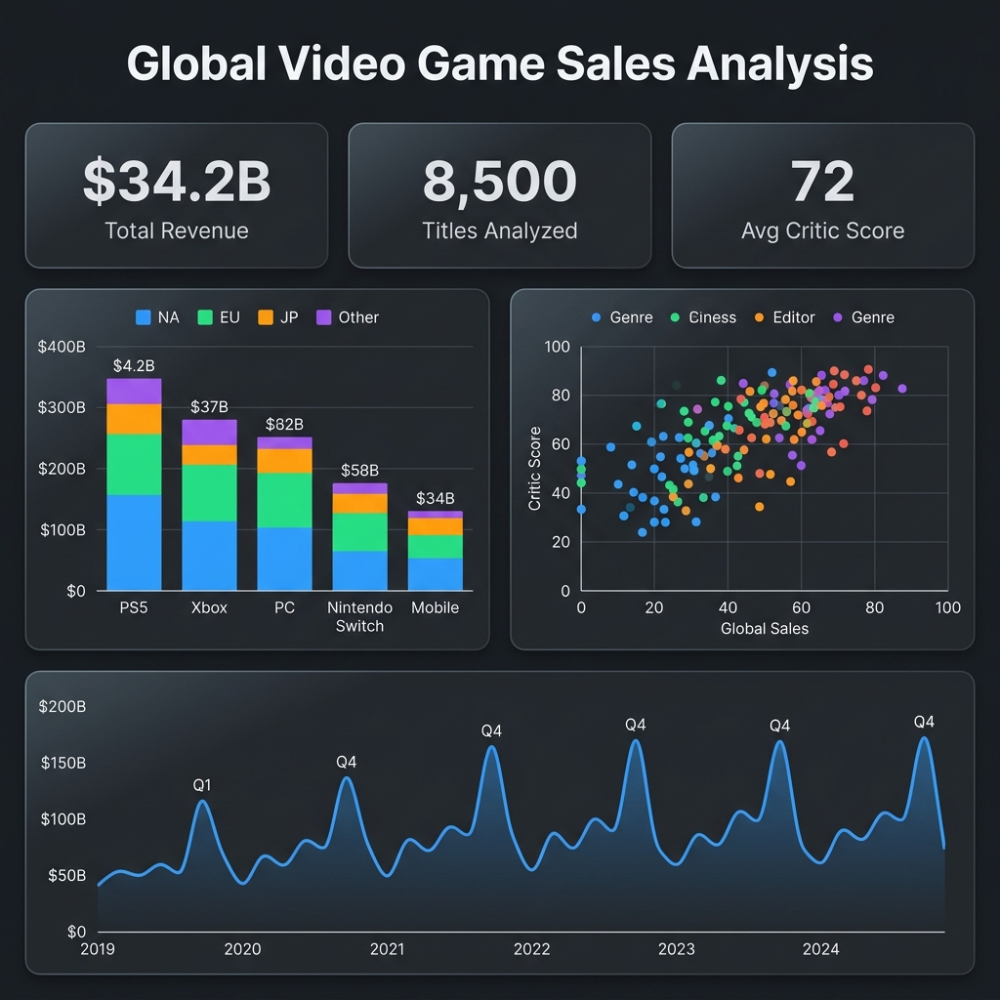
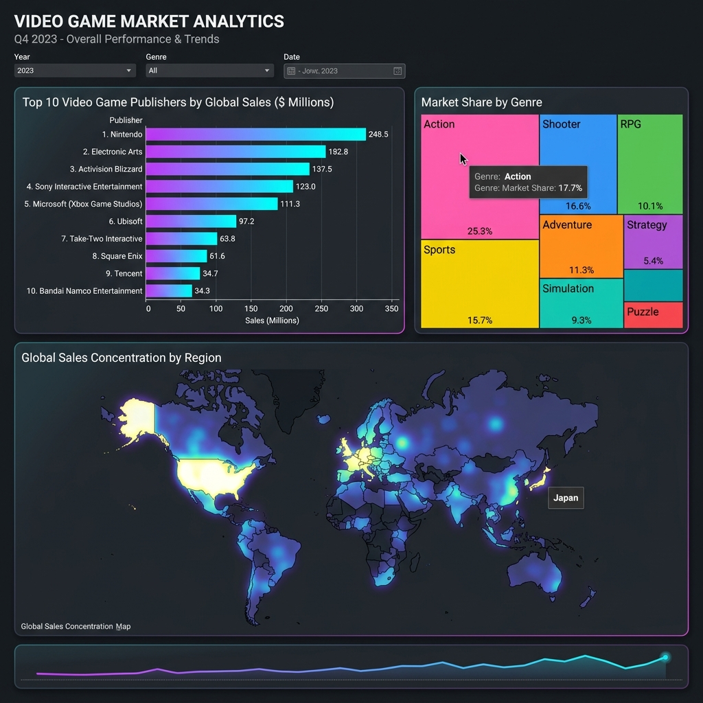

# Global Video Game Sales — BI Dashboard Pipeline


End-to-end data pipeline that generates, cleans, and prepares a global video game sales dataset for consumption in Business Intelligence tools like Looker Studio, Tableau, or Power BI.

## Dashboard Preview





## About This Project

An end-to-end **Data Engineering** and **Business Intelligence** pipeline. It bridges the gap between raw data extraction and final visualization, demonstrating the critical ETL processes required before building a dashboard.

**Keywords:** `ETL Pipeline`, `Data Cleaning`, `Python`, `Pandas`, `Data Visualization`, `Looker Studio`, `Tableau`, `Data Engineering`, `KPI Dashboards`, `Business Intelligence (BI)`

### Core Features
* **Data Generation:** Simulates 8,500+ realistic video game sales records, incorporating logic for regional market biases and Q4 seasonality.
* **Data Cleaning (Pandas):** Handles null imputation, outlier correction, negative value filtering, and duplicate removal.
* **Feature Engineering:** Derives calculated metrics (`Global_Sales`, `Quarter`) to optimize data for BI consumption.
* **BI Integration:** Outputs a clean, UTF-8 encoded CSV ready for seamless drag-and-drop into **Tableau** or **Looker Studio**.

## Project Structure

```
├── generar_datos.py        # ETL script (generation + cleaning)
├── datos_limpios.csv       # Final clean output (~8,500 records)
├── requirements.txt        # Python dependencies
├── assets/                 # Dashboard screenshots
│   ├── dashboard_overview.png
│   └── dashboard_detail.png
└── README.md
```

## Quick Start

```bash
git clone https://github.com/MgnumX/gaming-bi-dashboard.git
cd gaming-bi-dashboard
pip install -r requirements.txt
python generar_datos.py
```

The script outputs `datos_limpios.csv` in the working directory, ready to drag-and-drop into your BI tool.

## Recommended Visualizations

Once the CSV is loaded into Looker Studio, Tableau, or Power BI, these are the highest-value charts to build:

| Chart Type | Columns Used | Business Question |
|---|---|---|
| Scatter Plot | `Puntuacion_Critica` vs `Ventas_Globales_Millones` | Do good reviews actually translate into sales? |
| Stacked Bar | `Plataforma` × Regional Sales | Which console dominates each geographic market? |
| Time Series | `Mes_Lanzamiento` × `Ventas_Globales_Millones` | Is there a seasonal pattern in revenue? |
| Treemap | `Publisher` × `Ventas_Globales_Millones` | What's each publisher's market share? |
| Horizontal Bar | Top 10 Titles × `Ventas_Globales_Millones` | Which games are the top performers? |

## Key Insights

- **Seasonality confirmed:** Q4 consistently drives the highest sales volume, aligned with AAA release calendars and holiday shopping.
- **Critic score correlation:** Titles scoring above 80 show disproportionately high sales. Investing in QA has a direct ROI.
- **Regional dominance patterns:** Nintendo dominates Japan while shooters lead Western markets — marketing budgets should be regionalized accordingly.

---

**Emilio Morillo** — Data Analyst & BI Consultant

- juane.morillo@outlook.com
- [LinkedIn](https://www.linkedin.com/in/juan-emilio-morillo-358251274/)
